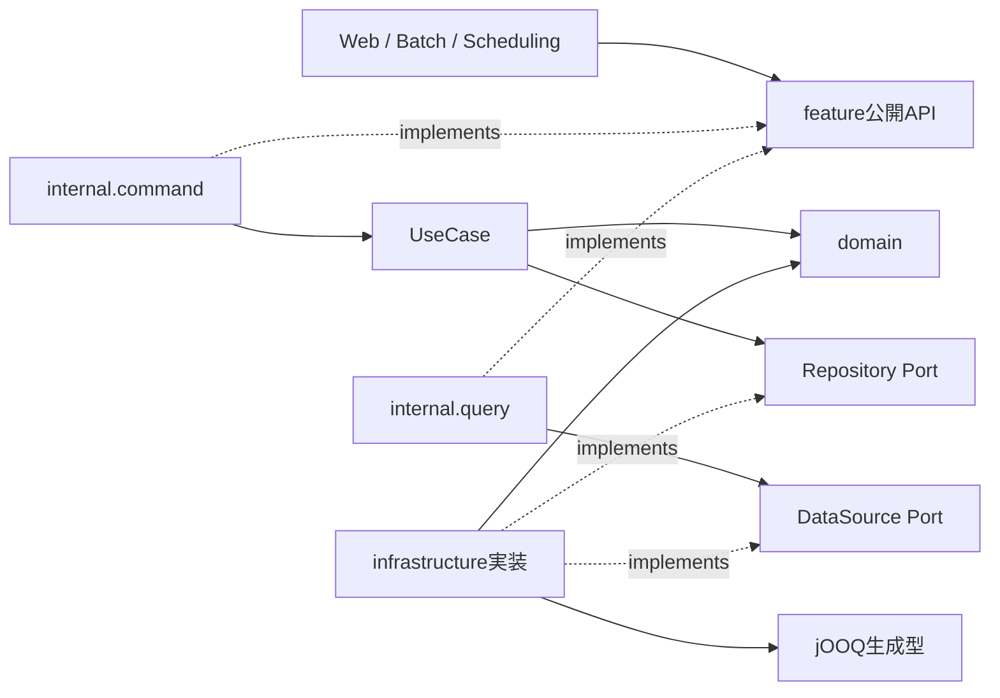

# spring-application-starter

Java 25／Spring Boot／Vaadin／PostgreSQLで、小規模〜中規模の業務システムを開発するためのstarter。少人数でも品質を維持できるよう、認可、DB、テスト、build、資料生成を共通の手順に揃える。案件では、この基盤に業務固有の機能を追加する。

## 最初に動かす

必要なものは **JDK 25、Git、稼働中のDocker、IDE**。GradleはWrapper、Node／npmはVaadinのbuild toolingが管理する。初回は依存、image、browserの取得にnetwork接続が必要になる。

1. repositoryを取得し、root directoryを開く。
2. `config/local-env.properties.example` を `config/local-env.properties` へコピーする。
3. コピーしたfileに `DEV_DB_PASSWORD`、`APP_USER_NAME`、`APP_USER_PASSWORD` を設定する。ログインpasswordは12文字以上・72 UTF-8 bytes以下。fileはGit管理外。
4. 起動する。

```bash
./gradlew bootRun
```

Windowsでは `gradlew.bat` を使う。bootRunは開発用認証を既定で有効にし、開発PostgreSQLの起動、Flyway migration、application起動まで実行する。配布JAR／OCIでは開発用認証は既定で無効となり、案件の認証実装・設定が必要。認証未設定なら起動を失敗させる。

**[http://localhost:8080/](http://localhost:8080/)** にwelcome、**[/components](http://localhost:8080/components)** にVaadin部品集を表示する。匿名で一覧・入力・Dialog・明暗表示などを試せる。部品集の編集はView内のsample dataだけに反映する。

**[/theme-comparison](http://localhost:8080/theme-comparison)** では同じ部品集をAuraとLumoで並べて比較できる。明暗切替と各テーマでの操作に対応する。

DB連携例 `/features` とREST `/api/v1/features` は認証必須。`/login` で設定した利用者としてログインできる。未認証のUIはloginへ誘導し、RESTは401を返す。作成は `feature:write`、参照は `feature:read` が必要。Batch／Schedulerは明示的なシステム主体で同じAPIを呼ぶ。詳細は[認証とシステム実行](docs/operations.md#authentication)を参照する。

設定形式、DBの保持、案件名の変更、起動時の問題は[初期セットアップ](docs/getting-started.md)を参照する。

## 設計の考え方

**Feature単位のModular Monolith＋Command／Query分離**を採用する。正しさ、型安全性、データ整合性、securityを優先し、実装手段はJDK・Spring・導入済みlibraryの順に選択する。

- REST、Vaadin、Batch、Schedulingは業務機能への入口となるadapter。featureの公開APIだけを呼ぶ。
- Commandは認可・transaction境界を持ち、UseCaseとdomainで業務規則を扱う。UseCaseがRepository Portを所有し、jOOQ adapterが実装する。
- Queryはread-only transaction内でDataSourceを呼び、参照結果を返す。
- feature間の依存は公開APIに限定する。他featureの更新は公開Command API、参照JOINは必要に応じてDBで行う。
- domainはframework非依存。UseCaseはBean登録用@Serviceのみ許可し、技術adapterとの連携をPortで表現する。
- module境界はSpring Modulith、追加の技術的依存規則はArchUnitで検証する。

図の実線はコンパイル時の依存、破線はinterfaceの実装関係を示す。



実行時は公開APIのBeanから各実装を呼び、注入されたinfrastructureがSQL処理を担う。詳細は[architecture](docs/architecture.md)、採用理由は[ADR](docs/decisions.md)を参照する。

## 開発の進め方

案件の開発を始める際は、[案件開始チェックリスト](docs/project-adoption.md)を使用する。名称・package、sample、認証と権限、DB、UI／API、CI・配布・運用の変更箇所と完了条件をまとめている。[自動化の選択肢](docs/project-adoption.md#自動化の選択肢未採用)は比較案であり、採用後に実装する。

1. [ADR](docs/decisions.md)と[開発ガイド](docs/developer-guide.md)を読み、対象featureの公開契約と制約を確認する。
2. 設計判断が変わる場合はADRを先に追加する。
3. 公開API、domain／UseCase、adapterを実装する。DB変更は新しいFlyway migrationを追加する。
4. 境界値、認可、transaction等、変更に対応するtestを追加・更新する。
5. 整形とbuildを実行する。DB／API sourceを変えた場合は資料も再生成する。

```bash
./gradlew spotlessApply build
./gradlew documentation
```

| コマンド                     | 用途                                                   |
| ---------------------------- | ------------------------------------------------------ |
| `./gradlew bootRun`          | 開発DBとapplicationを起動                              |
| `./gradlew jooqCodegen`      | 一時DBからSQL型を生成                                  |
| `./gradlew spotlessApply`    | format・import整理                                     |
| `./gradlew unitTest`         | 単体テスト                                             |
| `./gradlew integrationTest`  | PostgreSQL・REST・認可・HTTP・Batch・Chromium UIの検証 |
| `./gradlew architectureTest` | moduleと技術的依存境界の検証                           |
| `./gradlew test`             | 単体・結合・アーキテクチャテストとcoverage             |
| `./gradlew check`            | 静的解析・format・配布境界の検査                       |
| `./gradlew build`            | check・testとJAR生成                                   |
| `./gradlew bootBuildImage`   | 固定BuildpacksでローカルOCI image生成                  |
| `./gradlew documentation`    | DB資料・OpenAPI生成                                    |

資料生成は`documentation`で実行する。reportは `build/reports/`、JARは `build/libs/`、資料は `build/documentation/`。これらはGit管理外とする。

## コードの場所

| 配置                                                                                | 内容                                               |
| ----------------------------------------------------------------------------------- | -------------------------------------------------- |
| `src/main/java/dev/template/application/feature/`                                   | 公開APIと内部のCommand／Query／domain／SQL adapter |
| `src/main/java/dev/template/application/web/`                                       | RESTとVaadin                                       |
| `src/main/java/dev/template/application/{common,security,logging,http,scheduling}/` | 共通技術基盤                                       |
| `src/main/resources/db/migration/`                                                  | Flyway schema変更履歴                              |
| `src/test/java/`                                                                    | 全テスト。JUnit Tagでtaskを分離                    |
| `codegen/`                                                                          | 配布物から独立した生成ツール                       |
| `config/`                                                                           | 品質検査・formatter・ローカル設定例                |
| `docker/`                                                                           | 開発DBと資料toolchain                              |
| `docs/`                                                                             | 開発・運用ガイドとADR                              |

## 資料

[ドキュメント一覧](docs/index.md)から目的別に参照できる。

- [技術スタック・version管理](docs/technology-stack.md)
- [初期セットアップ](docs/getting-started.md)
- [案件開始チェックリスト・自動化案](docs/project-adoption.md)
- [architectureと依存方向](docs/architecture.md)
- [実装・Java・UIの開発規約](docs/developer-guide.md)
- [DB・migration・jOOQ](docs/database.md)
- [テストと品質検証](docs/testing.md)
- [設定・認証・運用・リリース](docs/operations.md)
- [資料の生成と更新](docs/documentation.md)
- [メンテナー向け：ビルド・生成ツールの仕組みと保守](docs/toolchain-maintenance.md)
- [設計判断の正本（ADR）](docs/decisions.md)

AIはrootの[AGENTS.md](AGENTS.md)を読み、対象領域のdocsへ進む。資料と実装が矛盾する場合はADRを優先する。
