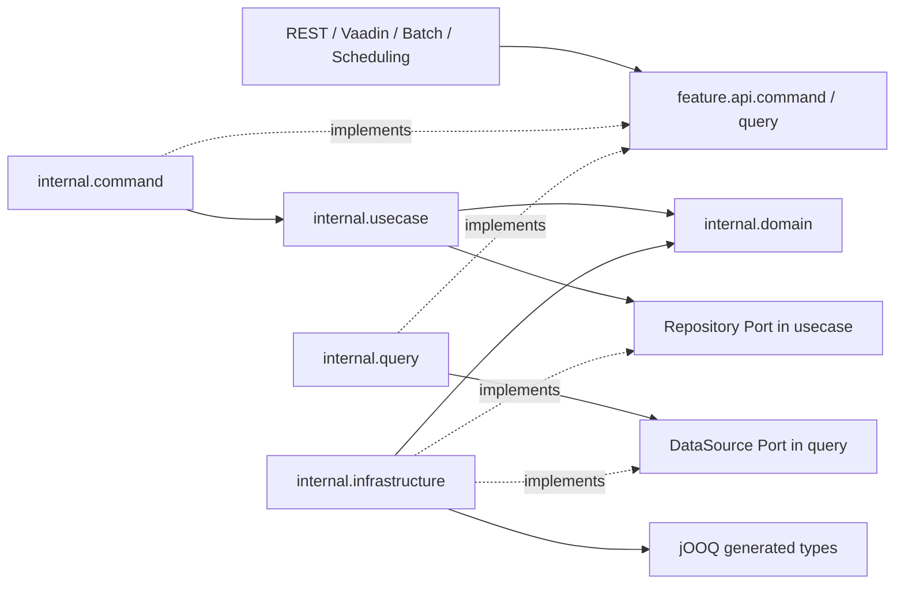
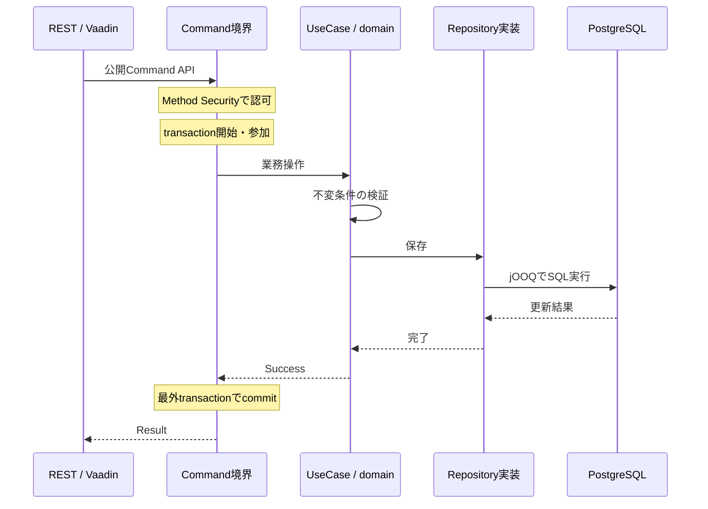

# Architecture

このapplicationはFeature-oriented Modular Monolithである。featureが公開契約と業務実装、DB schemaを所有する。設計理由は[ADR-004〜008](decisions.md#adr-004)を参照する。

## 依存方向

次の図の矢印はコンパイル時の依存を示す。破線はinterfaceの実装関係である。

実行時はadapterから公開APIのBeanを呼び、Command／Query実装が注入されたPortの実装を呼ぶ。Portを利用する側はjOOQ実装を知らない。

## packageと責務

| 配置 | 責務・許可する依存 |
|---|---|
| `feature.api.command` | 公開Command、Param、Failure契約 |
| `feature.api.query` | 公開Query、Param、read model |
| `feature.api.authorization` | feature権限enumと認可annotation |
| `feature.internal.command` | 認可、入力変換、transaction、UseCase呼び出し |
| `feature.internal.usecase` | 業務調整、Repository Port。@Service以外のSpring型に非依存 |
| `feature.internal.domain` | Entity、Value Object、不変条件。framework非依存 |
| `feature.internal.query` | 認可、read-only transaction、DataSource Port、公開結果への変換 |
| `feature.internal.infrastructure` | jOOQ、外部HTTP、storage等の技術adapter |
| `web.rest`／`web.ui` | HTTP／Vaadinへの変換、公開API呼び出し |
| `common` | Result、UTC Clock、UUID v7。業務moduleから独立した共通契約 |
| `security` | filter chain、認証・認可の技術設定、運用Authority |
| `logging`／`http`／`scheduling` | 横断ログ、標準HTTP設定、scheduler有効化 |
| `jooq` | 生成SQL型を含むopen technical module |

案件で必要になったBatch／Schedulingのadapterは、それぞれtop-level packageに置く。packageは実装の配置に合わせて作成する。

## CommandとQuery

Commandは更新の不変条件を守る。公開Paramを検証し、UseCaseがdomainを組み立ててRepositoryへ渡す。Commandのtransaction内で更新し、予期しないExceptionは伝播してrollbackする。期待される拒否は型付きFailureとして返す。

Queryは参照用途のSQLとread modelを優先する。DataSourceが内部FeatureDataを取得し、FeatureQueriesImplが公開FeatureResultへ変換する。domain Entityを復元するためだけにUseCaseを通さない。

| 制約 | 内容 |
|---|---|
| 更新transaction | internal.commandの@Transactional |
| 参照transaction | internal.queryの@Transactional(readOnly = true) |
| 認可 | 同じ境界の@RequiresFeatureAuthority |
| propagation | REQUIREDがdefault。REQUIRES_NEWは理由がある場合のみ |
| rollback | 例外はtransaction境界へ伝播し、rollbackを成立させる |
| self invocation | transaction／認可の境界はSpring proxyを通る公開API呼び出しとする |

### 更新の実行順序

公開APIの呼び出しはSpring proxyを通す。次の図は正常更新の流れを示す。業務処理の実行は認可成功時に限定する。実行時例外がtransaction境界へ伝播するとrollbackする。Failureの返却は通常の戻り値として扱われるため、業務拒否は更新前に判定する。

## module境界と可視性

package-info.javaのNamed Interfaceが公開範囲を定める。module間の参照範囲は公開APIとする。Javaのpackage間連携のためpublicな型でも、Modulithではinternalとして扱う。Beanはpackage-privateとconstructor injectionを基本にする。

featureはcommonとjooq、webはfeatureのcommand／query、common、loggingへの依存を宣言する。Modulithのverifyがmodule cycleと公開境界を検査する。ArchUnitはgenerated SQL型がinfrastructureに閉じること、domain／UseCaseのframework非依存などを追加検査する。

## featureを跨ぐ操作

他featureの更新はその公開Command APIを呼ぶ。各schemaの更新責任は所有featureに集約する。親Commandのtransactionへ参加させることで、関連更新を一つのtransactionとして扱える。

参照は必要に応じcross-feature JOINを許可する。View、projection、専用query moduleやcross-feature FKは、具体的な参照要件と整合性の要件が生じてから決める。同期結果が必要な業務処理をeventへ置き換えない。

## frameworkの境界

HTTP／Vaadin／Security／jOOQの型は技術adapterに配置する。外部HTTP DTOはinfrastructure、HTTP request／responseはwebに置く。操作者が必要な業務APIには用途に合うActor／UserId等を渡す。共通loggingはAOP／filter／interceptorで行い、記録項目を診断に必要な非機密情報へ限定する。
