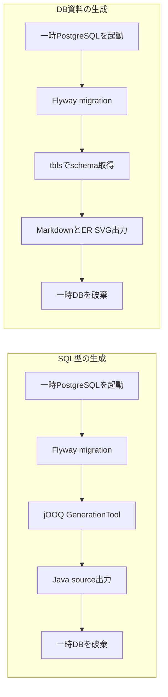

# DBガイド

設計判断は[ADR-007／008](decisions.md#adr-007)。schema変更はFlyway、JavaのSQL型はjOOQ、生成資料は実際のPostgreSQL schemaを正本とする。

## 所有権と型

schemaは原則feature単位。他featureへの直接writeは禁止し、公開Command APIを通す。cross-feature read JOINは許可する。同feature内のFKを活用し、cross-feature FKは整合性とmodule自律性を比較して案件で決める。

| 概念 | PostgreSQL | Java |
|---|---|---|
| ID | uuid | UUID。application側でv7生成 |
| 実時刻 | timestamptz | Instant。UTC Clockを注入 |
| 業務日付 | date | LocalDate |
| 時刻のみ | time | LocalTime |
| 金額・小数 | numeric(p,s) | BigDecimal |
| 長さ制限のある文字列 | varchar(n) | String。validationとDB制約を一致 |
| 長さ制限のない説明 | text | String |

実時刻はInstant／timestamptz、金額はBigDecimal／numericを使用する。地域計算にはZoneIdを明示する。NOT NULLをdefaultとし、absenceに意味がある場合だけnullableにする。booleanは本当に二値の概念に限定する。

| 対象 | 命名 |
|---|---|
| identifier | snake_case |
| 自tableのPK列 | id |
| 参照列 | `<target>_id` |
| PK | `pk_<table>` |
| FK | `fk_<table>_<referenced_table>` |
| UNIQUE | `uk_<table>_<column...>` |
| index | `ix_<table>_<column...>` |
| CHECK | `ck_<table>_<purpose>` |

削除はphysical delete。auditは必要なtableにだけcreated_at／updated_at／created_by／updated_byを使い、actor付与は案件で決める。論理削除列の採用は案件要件で判断し、履歴は履歴modelとして設計する。

## 4用途のDB

| 用途 | lifecycle |
|---|---|
| 開発 | Compose dev profile、persistent named volume、Boot起動・停止連携 |
| test | Testcontainers、隔離、一時利用後破棄 |
| jOOQ生成 | Testcontainersの一時DBからSQL型を生成 |
| 資料生成 | Compose docs profileの一時DBからschema資料を生成 |

生成処理は用途ごとに空のDBへmigrationを適用する。

図は正常終了時の順序を示す。一時DBの後始末は失敗時にも実行する。

Docker設定は[一つのCompose](../docker/compose.yaml)に集約する。PostgreSQL imageは[Catalog](../gradle/libs.versions.toml)と同じtagに揃える。開発DBはloopbackの動的portに公開し、PostgreSQL 18のvolumeは `/var/lib/postgresql` にmountする。

codegen／test／資料生成には用途別の一時DBとcredentialを使用する。DockerをDB testの必須実行条件とする。

## migrationを追加する

1. `src/main/resources/db/migration/<feature>/V<番号>__<説明>.sql` を追加する。番号は全featureで一意にする。
2. schema、table、constraint、必要なindex、table／columnのCOMMENTをSQLに記載する。
3. `./gradlew jooqCodegen` で生成型を更新し、infrastructureのSQLを実装する。
4. `./gradlew build databaseDocumentation` で空DBからのmigration、制約、SQL型、資料を確認する。

Flywayはfeature directoryを標準再帰scanする。共通履歴は `public.flyway_schema_history`。適用済みmigrationは履歴として保持し、変更は新migrationとする。productionも原則起動時適用、運用要件により事前migrationを選べる。

最小業務schemaは [V1](../src/main/resources/db/migration/feature/V1__create_feature.sql) のfeature.feature。UUIDのidとvarchar(100)のnameを持ち、NOT NULL／PK／ASCII spaceだけの値を拒否するCHECKを定義する。nameはcode point単位で検証し、同名を許容する。初期状態は空tableとし、列はidとnameで構成する。

起動に必要な最小system／sample dataはFlywayで登録できる。商品・顧客等の大量・高頻度master更新は案件の業務機能として設計する。

## jOOQ生成

`codegen` subprojectのJooqCodegenをJavaExecで呼ぶ。Boot BOMでFlyway／jOOQ／driver／Testcontainersを揃え、一時DBに適用されたschemaを標準GenerationToolへ渡す。

| 対象 | 配置・規則 |
|---|---|
| 生成source | build/generated-src/jooq |
| 生成package | dev.template.application.jooq.<schema> |
| 生成対象 | migration適用後の業務schema。information_schema、pg_*、public、systemのobjectは除外 |
| table参照 | jOOQ標準命名によるFeature.FEATURE_ |
| 使用範囲 | 各featureのinternal.infrastructure |
| module宣言 | src/main/java配下のjooq/package-info.java |

compileJavaは同じ生成taskへ依存する。migration・生成tool・image等の入力と出力が変わらなければUP-TO-DATEとなる。generated sourceの変更は再生成によって行い、Git管理外とする。生成型は配布JAR、生成toolと専用依存はcodegen subprojectの実行環境に配置する。

## Spring Batch metadata

[system/V2__create_batch_metadata.sql](../src/main/resources/db/migration/system/V2__create_batch_metadata.sql)はSpring Batch 6.0.5の公式PostgreSQL DDLに基づく6 table・3 sequenceを作成する。数値ID、timestamp、nullable等はframework仕様に準拠する。constraint名はrepository規約に揃える。

`spring.batch.jdbc.table-prefix=system.BATCH_`、`initialize-schema=never` とし、初期化をFlywayへ集約する。Batch更新時は公式DDLとの差分を確認し、必要なら新migrationを追加する。system schemaはjOOQの生成対象外とする。

JobParameters／ExecutionContextの保存内容は、処理の識別・再実行に必要な非機密情報に限定する。Jobの組み立て方は[運用ガイド](operations.md#batch)を参照する。

## DB資料

`./gradlew databaseDocumentation` でMarkdownとER SVGをbuild/documentation/databaseへ生成する。構造はmigration適用後のDBから取得する。COMMENTの修正はmigration、手書きの補足は本書、判断理由はADRへ置く。生成物の変更はsourceを修正して再生成する。詳細は[資料生成](documentation.md)を参照する。

業務schemaを追加した場合、jOOQとtblsへのschema名の列挙は不要。生成型はschema別packageとなり、既存schemaの型名・配置を変えずに追加できる。新しいtechnical schemaを導入する場合は生成対象・資料公開範囲を判断し、必要なら除外設定を更新する。
