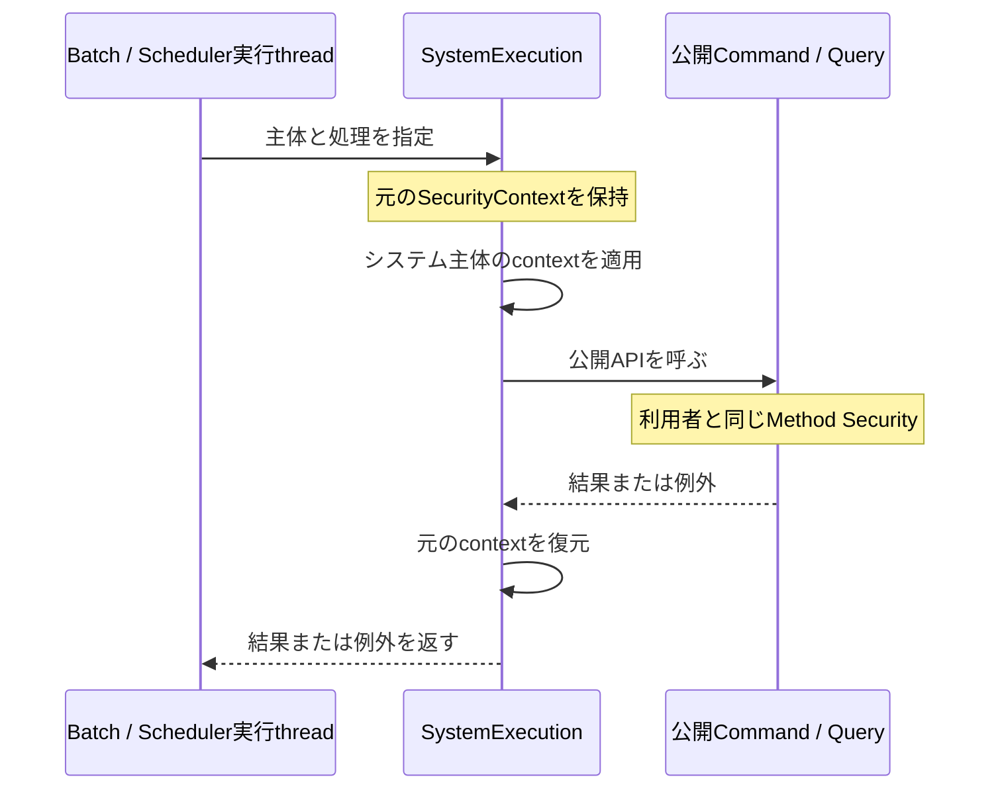

# 設定・運用・リリース

設計判断は[ADR-018](decisions.md#adr-018)、[ADR-012／013](decisions.md#adr-012)、[ADR-016](decisions.md#adr-016)を参照する。

## 設定

環境依存値は環境変数で注入する。application.ymlは安定設定と安全なdefaultに限定する。独自設定は@ConfigurationProperties／@Validated recordを使い、Duration／URI等で型付けする。必須不足や不正値は起動時に拒否する。

| 環境変数 | 用途・default |
|---|---|
| DEV_DB_PASSWORD | bootRunの開発Compose DB用。必須 |
| APP_USER_NAME | 標準利用者のログインID。必須 |
| APP_USER_PASSWORD | 標準利用者のpassword。12文字以上、72 UTF-8 bytes以下。必須 |
| APP_USER_OPERATIONS_READ | 標準利用者へのops:read付与。false |
| SPRING_DATASOURCE_URL | 配布JAR／OCIの既存PostgreSQL JDBC URL |
| SPRING_DATASOURCE_USERNAME | 配布先DBユーザー |
| SPRING_DATASOURCE_PASSWORD | 配布先DB password |
| HTTP_CONNECT_TIMEOUT | 外部HTTP接続timeout。2s |
| HTTP_READ_TIMEOUT | 外部HTTP応答timeout。10s |
| API_DOCUMENTATION_ENABLED | OpenAPI／Swagger UI。false |
| SERVER_PORT | HTTP待受port。8080 |
| SERVER_SERVLET_CONTEXT_PATH | 配置先path。未指定ならroot |

timeoutは正のDuration。bootRunだけはconfig/local-env.propertiesから環境変数を補完する。詳細は[setup](getting-started.md)。配布JARの設定は実行環境の環境変数から供給する。credentialの管理先はsecret管理基盤またはGit管理外のローカル設定とする。

<a id="authentication"></a>
## デフォルト認証と実行主体

Spring Securityのフォーム認証とVaadin標準LoginFormを使用する。`/login` へ設定したAPP_USER_NAME／APP_USER_PASSWORDを入力するとsessionが確立する。未認証の保護UIはloginへ誘導され、REST／Actuatorは401を返す。ヘッダーのログアウトはsessionを無効化する。

passwordは起動時にBCryptでencodeし、標準InMemoryUserDetailsManagerへ登録する。固定passwordや自動生成passwordはない。利用者名のsystem: prefixはシステム主体用に予約されている。設定不足と不正な長さは起動時に拒否する。利用者はfeatureの参照・更新権限を持ち、運用権限はAPP_USER_OPERATIONS_READ=trueの場合だけ付与する。

標準認証は設定値で定義する1利用者を対象とする。複数利用者、個別監査、password変更、SSO等が必要な案件ではUserDetailsService／認証providerを置き換える。UserDetailsServiceが定義されている場合はその実装を使用する。LocalAuthenticationConfigurationはAutoConfiguration.importsで登録し、案件側の通常Configurationの後に条件評価する。外部認証へ移行してもAuthorityとCommand／Queryの認可境界を維持する。

| 対象 | 必要な権限 |
|---|---|
| `/`、`/components`、`/theme-comparison`、`/theme-preview` | 匿名可 |
| `/features`、`/api/**` | 認証必須。各操作の本認可は下記 |
| FeatureCommands.create | feature:write |
| FeatureQueries.find | feature:read |
| `/actuator/health` | 匿名可、詳細なし |
| `/actuator/info`、`/actuator/metrics` | ops:read |
| 有効化したOpenAPI／Swagger UI | ops:read |

AuthenticationとAuthorityを区別する。業務権限のwire値はFeatureAuthority、運用権限はOperationsAuthorityが所有する。RoleはAuthorityの集合。domain／UseCaseへSecurityContextを持ち込まず、操作者が必要ならsecurity adapterで用途に合うActor／UserIdへ変換する。

CSRFは有効。REST・API資料・UIはSpring Securityのspa()を使用し、XSRF-TOKEN cookieの値をX-XSRF-TOKEN headerへ渡す。login／logout後は再取得したtokenを使う。API_DOCUMENTATION_ENABLED=trueとops:readを設定し、login後に `/swagger-ui/index.html` を開くと、Swagger標準のCSRF連携でTry it outから更新できる。

Vaadin内部通信は標準configurerに委ねる。RESTの未認証は401、権限不足と認証済みCSRF拒否は403、本文はProblemDetail。業務操作の権限はCommand／Queryの境界で検証する。

context pathを設定した場合、login・Swagger等のURLにもそのprefixを付ける。RESTのLocationとOpenAPI server URLはrequestに基づき生成する。reverse proxyを使う場合は、proxyが外部入力のForwarded／X-Forwarded-*を除去・再設定する構成にしたうえで、Bootのforwarded header設定を選ぶ。

## 外部HTTP

HTTP Service Client／Groupを第一選択、次にRestClientを使う。外部DTOとclient実装はfeature.internal.infrastructure、業務側は自身が必要とするPortを所有する。

HTTP Service interfaceを `@ImportHttpServices` でgroup登録し、Boot標準の `spring.http.serviceclient.<group>.base-url` 等を設定する。直接RestClientが必要ならBootから注入されたRestClient.Builderを使う。HTTP clientの生成元は共通timeoutとloggingを適用するBootのbuilderとする。

network／timeout／5xx／protocol異常はExceptionとし、意味のある外部応答のみ業務Failureに変換する。標準の実行回数は1回とする。更新系retryは冪等性とfailure semanticsが保証される場合に限る。credentialの保持・適用はclient設定の責務とする。

## ログと観測

受信HTTPごとにserverがX-Correlation-IDを生成し、responseとoutgoing requestへ伝播する。MDCのcorrelationIdでログを関連付ける。リクエスト終了時に以前のMDCを復元する。

Command開始／終了／FailureはINFO、Query開始／終了はDEBUG、予期しない技術障害はERROR。共通ログは処理名、method、host、status、所要時間、例外型とstack frameを記録する。ログ項目は上記の診断情報に限定し、通常の処理ログはlogging moduleで実装する。

Actuator／MicrometerでhealthとHikariCP pool metricsを確認する。pool size／timeoutのtuningは計測と案件の接続数上限に基づいて行う。Prometheus、OpenTelemetry、構造化JSON logは必要な運用先が決まった場合に追加する。

終了はBoot標準graceful shutdown、phase timeoutは30秒。運用先で受付停止、終了待ち、DB接続等の実動作を確認する。

<a id="batch"></a>
## BatchとScheduling

BatchはJDBC JobRepositoryを使用し、実行履歴をsystem schemaへ永続化する。schemaはFlywayが管理し、Jobの起動時自動実行は無効。productionのsample Jobはない。

案件Jobを作る場合は、restart／history／chunk等の要件を確認し、batch adapterから公開APIを呼ぶ。共通JobExecutionListener BeanをJobBuilderのlistener(...)へ明示登録する。Failureの扱いはJobの意味に応じて決め、予期しないExceptionはJob failureとする。

BatchLoggingの秘匿対象はこのlistener自身の出力である。Spring Batchはlistenerより先に例外messageをログ出力し、ExitStatusの説明にも保存する。frameworkによる出力・保存は個別の保護対象として扱う。例外messageへcredential・payload・不要PIIを含めず、Batch metadataとログの参照権限・保持期間を制限する。外部libraryの例外も含めて一律秘匿が必要な場合、診断情報の保持範囲とログ／metadata双方の処理方針を決めてから導入する。

JobParameters／ExecutionContextはDBへ保存されるため、保存内容は処理に必要な非機密情報に限定する。framework launcherのparameter INFO logはWARN thresholdで抑えている。業務操作は以下のSystemExecution境界で正式なシステム主体を適用する。システム主体にも公開APIの認可規則を適用する。

Schedulingは@EnableSchedulingとBoot標準schedulerで有効化する。単純定期処理はscheduling adapterの@Scheduledから公開APIへ委譲する。多重起動、失敗時の再実行、transaction境界は案件要件に応じて決める。定期処理は具体的な業務要件に基づいて追加する。

### システム主体で業務APIを呼ぶ

| 主体 | 権限 |
|---|---|
| SystemActor.BATCH | feature:read、feature:write |
| SystemActor.SCHEDULER | feature:read |

batch／scheduling adapterへSystemExecutionと公開APIをconstructor injectionする。次はBatch tasklet内の呼び出し例。

```java
return systemExecution.call(SystemActor.BATCH, () -> {
    final var result = commands.create(new CreateFeatureParam(name));
    return switch (result) {
        case Result.Success(var id) -> RepeatStatus.FINISHED;
        case Result.Failure(var reason) -> throw new IllegalArgumentException("Batch input rejected");
    };
});
```

Schedulerの参照は `systemExecution.call(SystemActor.SCHEDULER, () -> queries.find(param))` とする。callはchecked Exceptionを伝播するため、@Scheduled methodでは失敗を隠さず呼び出し元のerror handlingへ渡す。非同期・並列Batchでは、実際に公開APIを呼ぶworker／tasklet／processor内でcallする。Job起動スレッドのcontextがworkerへ継承されるとは考えない。



Spring標準DelegatingSecurityContextCallableが、正常・例外・nested実行後に元のcontextを復元する。システム主体とその権限は信頼されたadapterのコードで選択する。利用者名と区別できる `system:batch`／`system:scheduler` を認証名に使う。システム実行境界はArchUnitでbatch／scheduling／securityに限定する。権限を変更する場合はSystemActorとADR、許可・拒否testを合わせて更新する。

## JAR／OCIで実行する

```bash
./gradlew bootJar
java -jar build/libs/spring-application-starter-0.1.0-SNAPSHOT.jar
```

上記は初期versionの例。実際のfile名はGradle project name／versionに従う。起動前に既存PostgreSQLへの3つのSPRING_DATASOURCE_*とAPP_USER_NAME／APP_USER_PASSWORDを環境から与える。JARには開発用Compose連携が含まれず、Flywayが接続先へmigrationを適用する。適用権限、backup、既存schemaへの影響は配置先で管理する。

```bash
./gradlew bootBuildImage
```

固定Paketo builder／run imageで `<project.name>:<project.version>` をローカルDockerへ生成する。実行時はJARと同じDB環境変数を渡す。registry pushとdeploymentは案件側で設定する。application imageはBuildpacksで構築し、配置構成は案件で定義する。

## CIとリリース

CIはbranch push／pull requestでGradleのbuildでcheck・全test・coverage・JAR生成を実行する。Ubuntu 24.04とJDK 25を使い、Linux browser依存はplaywrightInstallDepsで用意する。reportはActions artifactへ14日間保存する。

正式releaseの手順:

1. root build.gradle.ktsのversionを `1.0.0` 等のstable SemVerへ変更する。
2. test、build、資料、OCI生成を確認してcommitする。
3. project versionと一致する `v1.0.0` 等のtagをpushする。
4. release workflowの検証と添付成果物を確認する。

```bash
./gradlew verifyReleaseVersion -PreleaseTag=v1.0.0
./gradlew build releaseArtifacts bootBuildImage
```

最初のcommandはproject versionが1.0.0の場合の例。snapshotや不一致tagは拒否する。releaseArtifactsはbuild/releaseへJAR、OpenAPI YAML、DB資料ZIPを集める。tag起点のworkflowだけが別の公開jobでGitHub Releaseへ添付する。workflow_dispatchの責務はbuildとartifact保存とする。

ActionsはSHA固定、通常contents:read、公開jobのみcontents:write、checkout credentialの永続化は無効とする。registryへのpushとdeploymentはこのworkflowの対象外。

## 案件で接続する環境

- GitHub Actionsの有効化、main branchの保護とCI成功条件。
- Renovate App。Gradle／Wrapper／Docker／Actions／資料npmを追跡し、mergeはreview後に実施する。
- 認証provider、実行環境のsecret、DB権限、backup／restore、監視・deployment。

PostgreSQLのCompose／Catalogは同じ更新PRで揃える。Paketo imageもgroup更新する。資料imageのDebian snapshot日付は手動で検証して更新する。外部環境の接続状態はrepository内の設定だけでは確認できない。
