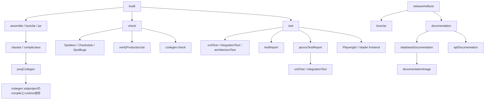
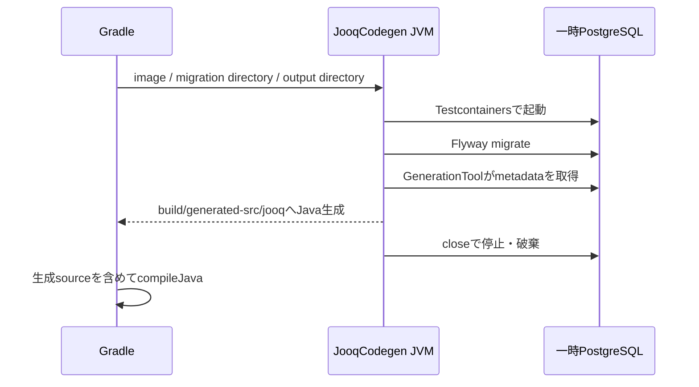

# ビルド・生成ツールの保守ガイド

本書は、taskの内部動作を追い、変更の影響を判断し、生成失敗を調査するメンテナー向けの資料である。日常の操作は[初期セットアップ](getting-started.md)、[検証](testing.md)、[資料生成](documentation.md)、設計の正本は[ADR](decisions.md)を参照する。

## 読む順序

1. Gradleの実行モデルとtask間の関係を理解する。
2. source・設定・生成物・実行プロセスの対応を確認する。
3. 対象の処理を個別taskで実行し、入力から出力まで追う。
4. 増分実行と失敗時の後始末を確認してから設定を変更する。

本書は現在の実装を説明する。versionの正本はCatalog・Wrapper・Dockerfileとする。図は各Markdown資料で読む。

## 1. Gradleを読むための基礎

### Wrapper・Toolchain・Catalogの役割

| 対象 | 管理元 | 何を決めるか |
|---|---|---|
| Gradle本体 | [Wrapper properties](../gradle/wrapper/gradle-wrapper.properties) | 配布URL、SHA-256検証、取得timeout |
| rootとsubproject | [settings.gradle.kts](../settings.gradle.kts) | project名、codegen subprojectの参加 |
| Java Toolchain | [root build](../build.gradle.kts)、[codegen build](../codegen/build.gradle.kts) | compile・実行に使うJDK。生成用JavaExecにもjavaLauncherを指定 |
| dependency／plugin | [Version Catalog](../gradle/libs.versions.toml) | aliasと明示version。versionなしのSpring系dependencyはBOMで解決 |
| taskと接続関係 | [build.gradle.kts](../build.gradle.kts) | 入出力、実行順、classpath、生成物の収集 |
| build cache | [gradle.properties](../gradle.properties) | org.gradle.caching=true |

`./gradlew`はWrapperで指定されたGradleを取得・実行し、そのGradleが要求されたtaskを実行する。global Gradleは不要だが、Gradle自体を起動できるJDKと、Toolchainで要求するJDKが必要になる。

Catalogの`libs.spring.boot.bom`等はaliasである。`implementation(platform(...))`がdependencyのversion制約を与える。Catalogにversionがないlibraryを、未管理dependencyと取り違えない。plugin versionと、そのpluginが動かす解析engineのversionも別物である。

### 設定フェーズと実行フェーズ

Gradleはprojectを初期化し、build scriptを評価してtask graphを作り、必要なtaskを実行する。`tasks.register`はtaskの遅延登録、`tasks.named`は登録済みtaskの設定に使う。`Provider`は必要時に値を取得する仕組みで、task出力を他taskへ渡す場合にも使う。[Gradleの実行モデル](https://docs.gradle.org/current/userguide/build_lifecycle.html)

| 記述 | 意味 | このprojectの例 |
|---|---|---|
| dependsOn | 前提taskを実行対象に含める | integrationTestがplaywrightInstallを要求 |
| shouldRunAfter | 両方が実行対象の場合の順序を指定する | architectureTestはintegrationTestの後 |
| finalizedBy | 対象taskの終了後に後始末を予定する | databaseDocumentation終了後にstopDocumentationDatabase |
| doFirst | task本体の前に行う処理 | bootRunのローカル環境読込、資料DB起動 |
| doLast | task本体の後、または独自taskの処理 | tbls実行、ER描画 |
| inputs／outputs | 再実行判断に使う入力・出力 | 入力はmigration、出力はgenerated-src/jooq |
| onlyIf | task実行の条件 | 起動した資料DBだけを停止する |

Docker起動やfile出力を設定フェーズへ置かない。そうすると`tasks`や`--dry-run`でも副作用が起こる。taskには文字列の出力pathだけでなく、可能なら生成元taskのProviderを渡して依存関係を伝える。

### task graphの概略

矢印は「実行に必要とする相手」を示す。図は主要なtask間の依存を示す。



資料生成は`documentation`、資料契約の検証とOpenAPI出力は`apiDocumentation`が担当する。`check`は配布境界を検証するためbootJarも必要になる。checkは静的検査、testはJUnit実行とcoverageを担当する。releaseArtifactsは生成・収集だけを担当し、CIはbuildを先に要求する。正確なgraphは`./gradlew build --dry-run`で確認する。

## 2. dependencyの用途と配布範囲

rootの`codegenRuntime`は、生成ツールを実行するためだけの解決可能configurationである。`project(":codegen")`をここへ追加し、JavaExecのclasspathに使う。applicationの実行依存と生成toolの実行依存をconfigurationで分離する。

| configuration | 用途 |
|---|---|
| implementation／runtimeOnly | applicationが必要とするlibrary／実行時driver |
| developmentOnly | Vaadin開発支援とBoot Docker Compose連携。開発時の実行環境専用 |
| testImplementation | JUnit、Testcontainers、Playwright等の検証用library |
| codegenRuntime | codegen subprojectと生成実行用の依存 |

`verifyProductionJar`はbootJarのZIP entryを調べる。実際のmain classが収録され、test／codegen classとcodegen tool JARが収録されていないことを照合する。対象は実際のclass出力とJAR entryである。resourceの機密検査とdependencyの脆弱性検査はそれぞれの運用要件で扱う。

## 3. bootRunと4種類のDB

| 用途 | 起動・接続の担当 | データの寿命 |
|---|---|---|
| 開発DB | bootRunで起動したBootのDocker Compose連携 | named volumeに保持 |
| test DB | Testcontainers、ServiceConnection | test用の一時DB |
| jOOQ DB | JooqCodegenのPostgreSQLContainer | 生成処理のtry-with-resources内 |
| DB資料用DB | GradleからComposeのdocs profile | 資料生成後に停止・volume削除 |

Compose定義は[docker/compose.yaml](../docker/compose.yaml)の一つ。devとdocs profileを使い分ける。API資料もtest DBを使い、DB資料用DBとは別である。

bootRunのdoFirstは`config/local-env.properties`をUTF-8 Java Propertiesとして読み、既存環境変数がないkeyだけを子Javaプロセスへ渡す。Spring Bootがapplication.ymlの環境変数mappingを解決し、同じプロセス内のSecurity・Swagger・HTTP clientへ反映する。test・資料task・配布JARはこのfileを読まない。

Bootがdev PostgreSQLの動的host portを検出し、接続情報をapplicationへ渡す。そのDBへFlywayを適用してからapplicationが起動する。開発DBのvolumeは通常停止では消さない。既存DBのpasswordは環境変数を書き換えても変更されない。

## 4. jOOQコード生成

入口は`jooqCodegen`、実装は[JooqCodegen.java](../codegen/src/main/java/dev/template/build/JooqCodegen.java)。JavaExecからjOOQ標準GenerationToolを呼ぶ構成である。



### 入力と生成規則

- PostgreSQL imageはCatalogのpostgres-imageから渡す。
- migrationは`src/main/resources/db/migration`。生成用JVMへ渡したfilesystem directoryから読む。
- Flywayの履歴はpublic schema。生成ごとに空DBへ全migrationを適用する。
- jOOQは適用後の実DB metadataから型を生成する。
- 業務schemaを対象とし、information_schema・pg_*・public・systemのobjectを除外する。
- targetは`dev.template.application.jooq`、その下をschema別packageに分ける。別schemaに同名tableがあってもpackageが分かれる。
- generated annotationの日付を出さず、実行日時だけの差分を避ける。

`sourceSets.main.java.srcDir(jooqCodegen)`が出力directoryと生成taskへの依存を結び付ける。生成型がないclean状態では`unitTest`を要求しても、そのcompileの前に一時DBを使う。生成JavaはGit管理外とし、変更はmigrationまたは生成設定の修正から再生成する。

### 変更時に追う場所

| 変更 | 確認先 |
|---|---|
| table／column追加 | 新migrationを追加し、jooqCodegen後にRepository／DataSourceをcompile |
| 業務schema追加 | 生成packageと同名tableの分離。schema名の列挙追加は不要 |
| technical schema追加 | 生成対象に含めるかを判断し、JooqCodegenの除外規則を確認 |
| base package変更 | target package、Java import、Modulith／ArchUnit、AutoConfiguration.imports等の[連動箇所](project-adoption.md) |
| jOOQ更新 | Boot BOMとの解決結果、生成source差分、非推奨警告、runtimeとの互換性 |

## 5. DB資料生成

入口は`databaseDocumentation`。処理を三段階に分けて追う。

1. **doFirst:** 一意のCompose project名でdocs-postgresを起動し、healthcheck完了を待つ。公開portを取得し、JDBC URLとmigration directoryをJavaExecの引数へ設定する。
2. **JavaExec:** [DocumentationMigration.java](../codegen/src/main/java/dev/template/build/DocumentationMigration.java)がFlywayを適用する。DB passwordはGradleが生成し、DOCS_DB_PASSWORDで渡す。
3. **doLast:** docs-toolsで[database.sh](../docker/docs/database.sh)を実行し、tblsがschemaを取得してMarkdown・schema.json・ERを出力する。

[.tbls.yml](../.tbls.yml)が資料名、説明、対象除外、出力先を定義する。table／columnの説明はmigrationのPostgreSQL COMMENTから取得する。手書き補足はdatabase.md、判断理由はADRへ置く。

ERはtbls標準のMermaid出力をmmdcでSVG化する。mmdcが生成Markdown内の図をSVG参照へ置き換える。showColumnTypesで関係カラムに絞り、全カラムはMarkdownの表で確認する。`--force --rm-dist`で古い資料を残さず作り直すため、出力先へ手書き資料を置かない。

Composeのsource mountはread-only、`build/documentation`だけを書き込み可能にする。stopDocumentationDatabaseをfinalizerにして、失敗時にも起動済みDBの後始末を試みる。強制killやDocker障害で残ったresourceは、Compose project名を確認して手動で後始末する。

## 6. OpenAPIとSwagger UI

| 要素 | 責務 |
|---|---|
| springdoc | Spring MVCのMapping、DTO、validation、OpenAPI annotationを解析 |
| application.yml | web.rest配下のscanと、HTTPでの資料公開の有効／無効 |
| [OpenApiConfiguration](../src/main/java/dev/template/application/web/rest/OpenApiConfiguration.java) | application名、共通説明、ProblemDetail schema、未定義の共通エラー応答 |
| [ApiDocumentationTest](../src/test/java/dev/template/application/web/rest/ApiDocumentationTest.java) | ops:readによる保護を確認し、取得したYAMLをfileへ出力 |
| [FeatureApiDocumentationTest](../src/test/java/dev/template/application/web/rest/FeatureApiDocumentationTest.java) | sample APIのschema契約を検証 |
| SwaggerUiIntegrationTest | browser上のlogin、CSRF、Try it out、context pathを検証 |

apiDocumentationはdocumentation Tagを実行するTest task。SpringBootTestがOpenAPIを明示的に有効化し、MockMvcとtest認証で`/v3/api-docs.yaml`を取得する。追加のAPP_USER_*やAPI_DOCUMENTATION_ENABLED設定は不要で、test resourcesの設定を使う。

Controllerをweb.rest配下へ追加するとscan対象に入る。API登録一覧やpath総数の更新は不要だが、条件別のresponse body、業務Failure、説明等は自動推論だけでは十分でない。必要なannotationと契約testを追加する。共通エラー設定は個別APIの定義を優先する。

出力先は`build/documentation/api/v1/openapi.yaml`。出力対象はspringdocのscan設定で決まり、保存先名とは独立している。別major versionを導入する場合は、全体資料として扱うかspringdocのgroupで分けるかを決め、出力task・test・release収集先を同時に更新する。

Swagger UIは起動中のapplicationのOpenAPI endpointを読む。ブラウザーでの有効化・loginは[運用ガイド](operations.md#authentication)を参照する。

## 7. 資料生成imageとMermaid

### documentationImageの中身

[Dockerfile](../docker/docs/Dockerfile)はtblsとNodeのimageからbinaryを取得し、固定したDebian snapshotからChromium・日本語font等をinstallする。Mermaid CLIは[package.json](../docker/docs/package.json)とlockfileから`npm ci`で導入する。Puppeteer自身によるbrowser取得は無効にし、containerのChromiumを使う。

この固定はtoolchainの再現性を高めるためである。ER図の文字・関係線は描画結果を確認する。Docker tagはbuildとComposeで一致させる。documentationImageはdocker buildを実行するExec taskとし、layerの再利用はDockerが判断する。

## 8. テスト・静的解析・Vaadin frontend

全test sourceはsrc/test/java。rootのtestClasses出力とruntimeClasspathを使い、JUnit Tagでtaskを分ける。新source setを増やさず、test追加時はTagと実行taskが一致することを確認する。

| 道具 | 入力・動作 | メンテナーが変更する場所 |
|---|---|---|
| JUnit／AssertJ | unit・integrationの契約検証 | test source、Tag、taskのinclude／exclude |
| Testcontainers | 実PostgreSQLを起動。ServiceConnectionがBootへ接続情報を供給 | test container定義、Catalogのimage |
| Playwright | 実ChromiumでUIを操作。captureをreports/uiへ出力 | UI test、playwrightInstall、LinuxのplaywrightInstallDeps |
| Vaadin Gradle plugin | JavaのUI構成と必要なfrontend資産を準備・build | Catalog、Vaadin設定、vaadinBuildFrontendのログ |
| Spotless／Eclipse JDT | format・import整理 | config/formatter/eclipse-java.xml、spotless block |
| Checkstyle | 手書きsourceの構文規約検査 | config/checkstyle/checkstyle.xml |
| javac | 非推奨／削除予定API参照を警告から失敗へ変える | root／codegenのJavaCompile設定 |
| SpotBugs | bytecodeの欠陥候補を解析 | engine version、config/spotbugs/exclude.xml |
| Modulith／ArchUnit | module公開境界・cycleと追加依存規則 | ArchitectureTest、package-info.java |
| JaCoCo | unitTestとintegrationTestの実行情報を集計 | executionData、classDirectories、report設定 |

integrationTestはplaywrightInstallとvaadinBuildFrontendへ依存する。browser本体とLinux共有libraryのinstallは別taskである。Playwrightはtest用classpathに配置する。Vaadin生成物やNode関連資産はpluginの出力として扱い、更新は再生成で行う。

Spotlessは整形、Checkstyleは規約、SpotBugsはbytecode解析を担当する。jOOQ生成Javaはcompile対象だが、手書きsource用Checkstyle／Spotlessからは外す。SpotBugsは生成classを解析対象から外しつつ、参照解決用classpathには残す。JaCoCoも生成型を集計から除外する。集約test・architectureTest・apiDocumentationではJaCoCo agentを無効にしている。testは専用taskとcoverageを集約する。JaCoCo reportはunitTest.execとintegrationTest.execだけを集計する。

## 9. UP-TO-DATE・cache・再実行

入力と出力が直近の実行時と一致してtaskを省略するのがUP-TO-DATE、対応する保存済み出力を復元するのがFROM-CACHEである。cacheの適用可否はtask型と入出力宣言で決まる。configuration cacheはtask graphの設定処理を再利用する機能で、本projectでは無効とする。[増分実行](https://docs.gradle.org/current/userguide/incremental_build.html)、[build cache](https://docs.gradle.org/current/userguide/build_cache.html)

| task | 明示した主な入力 | 出力 |
|---|---|---|
| jooqCodegen | migration、PostgreSQL image。JavaExecのclasspath等も関係 | generated-src/jooq |
| databaseDocumentation | migration、.tbls.yml、docker/docs、compose.yaml | documentation/database |
| apiDocumentation | Testのclass／classpathと設定、出力pathのsystem property | documentation/api/v1/openapi.yaml、test report |
| integrationTest | Testのclass／classpathと設定、PostgreSQL imageのsystem property | test report、reports/ui |

入力を追加したらinputsにも追加する。外部fileを読んでいるのに未宣言だと、変更しても古い出力を使うことがある。逆に、不要な時刻や乱数を生成物の入力へ入れると毎回実行になる。cache keyの入力は再現性の判断に必要な非機密情報に限定する。

UP-TO-DATEは既存出力の削除で、cacheからの復元は`--no-build-cache`で制御する。実際にtestを再実行したい場合は、たとえば次を使う。

```bash
./gradlew cleanUnitTest cleanIntegrationTest cleanArchitectureTest build --no-build-cache
./gradlew cleanApiDocumentation apiDocumentation --no-build-cache
./gradlew jooqCodegen --rerun-tasks
```

`--rerun-tasks`は依存taskも再実行するため重い。再実行方法は該当taskの入力・出力と実行理由を`--info`で確認して選ぶ。`clean`の削除対象は各projectのbuild出力とする。

## 10. task一覧と配布経路

| task | 提供元／型 | 主な用途 |
|---|---|---|
| bootRun | Boot／BootRun | 開発設定を読んでhost JVMで実行 |
| jooqCodegen | project／JavaExec | 一時DBからSQL型を生成 |
| unitTest | project／Test | Tagで分類した単体test |
| test | Java／Test（集約） | unit・integration・architectureとcoverage |
| integrationTest・architectureTest | project／Test | DB／UIと境界検証 |
| spotlessApply・spotlessCheck | Spotless | 整形／差分の検査 |
| checkstyleMain・checkstyleTest | Checkstyle | source規約 |
| spotbugsMain・spotbugsTest | SpotBugs | bytecode解析 |
| testReport | project／TestReport | 3種類のtest結果のHTML集約。testから実行 |
| jacocoTestReport | JaCoCo | unit＋integrationのcoverage |
| verifyProductionJar | project | classの配布境界 |
| check | Gradle lifecycle | 静的解析・整形・配布境界 |
| build | Gradle lifecycle | check・test・成果物作成 |
| documentationImage | project／Exec | 資料tool imageのbuild |
| databaseDocumentation・stopDocumentationDatabase | project | DB資料生成とcleanup |
| apiDocumentation | project／Test | OpenAPI取得・検証・出力 |
| documentation | project | DBとOpenAPIの2資料を集約 |
| playwrightInstall・playwrightInstallDeps | project／JavaExec | browser／Linux共有library |
| bootJar・jar | Boot／Java | 実行可能JAR／通常JAR |
| bootBuildImage | Boot／BootBuildImage | Catalogで指定したBuildpacksによるOCI image |
| verifyReleaseVersion | project | stable SemVerとv付きtagの一致 |
| databaseDocumentationZip | project／Zip | DB資料をdistributions配下へ圧縮 |
| releaseArtifacts | project／Sync | JAR・DB ZIP・OpenAPIをbuild/releaseへ収集 |

`Sync`は収集先を指定した生成物と同期する。build/releaseは配布物専用の出力先とし、実行可能JARにはbootJarを使う。

[CI](../.github/workflows/ci.yml)はLinux browser依存をinstallしてbuild（check・test・成果物作成）を実行し、reportを保存する。[Release](../.github/workflows/release.yml)はtagを検証し、資料・JAR・OCI imageをbuildする。tag起動時だけ後続jobがGitHub Releaseへfileを公開する。OCI registryへのpush・application deploymentは、このworkflowの実装には含まれない。

[Renovate](../renovate.json)はGradle・Wrapper・Docker・Actions・資料用npm等の更新を提案する。Catalog内のDocker imageはregex managerで拾う。automergeは無効。BOM更新時は間接的に変わるdriver／jOOQ／Flyway／Security等の解決結果も確認する。

## 11. 調査コマンドと症状別の切り分け

まず「task未実行」「tool起動失敗」「出力内容不正」のどれかを区別する。

```bash
./gradlew tasks --all
./gradlew help --task jooqCodegen
./gradlew build --dry-run
./gradlew documentation --dry-run
./gradlew jooqCodegen --info --stacktrace
./gradlew dependencies --configuration runtimeClasspath
./gradlew dependencyInsight --dependency jooq --configuration runtimeClasspath
./gradlew :codegen:dependencies --configuration runtimeClasspath
```

rootのcodegenRuntimeも`dependencies --configuration codegenRuntime`で確認できる。`-P`はGradle project property、JavaExecのargsはmainへの引数、TestのsystemPropertyはtest JVMの`-D`、environmentは子プロセスの環境変数として使い分ける。

| 症状 | 調べる順序 |
|---|---|
| 生成型がない | 1. jooqCodegenの実行状態<br>2. migration適用<br>3. schema除外<br>4. output package<br>5. main sourceへの接続 |
| 新columnが反映されない | 1. migrationの入力に含まれるか<br>2. UP-TO-DATE理由<br>3. 生成型。生成元はmigration適用後の一時DB |
| migration失敗 | 1. 対象DBの用途<br>2. Flyway最初の原因<br>3. version重複／checksum／SQL。schema修正は新migrationで行う |
| test対象が0件 | JUnit Tag、taskのinclude／exclude、--testsのclass／method指定 |
| UI test起動失敗 | Playwright取得、Linux共有library、Vaadin frontend生成、server起動の順 |
| DB資料にtableがない | 1. migration<br>2. .tbls.ymlのexclude<br>3. schema.json<br>4. Markdown／SVG |
| Swaggerに新APIがない | 1. ControllerがBeanか<br>2. Mapping<br>3. packages-to-scan<br>4. 起動中serverのOpenAPI。稼働中serverのmetadataを確認する |
| API資料生成が失敗 | 1. ApiDocumentationTest／FeatureApiDocumentationTestのreport<br>2. 401／403／schema契約／DB起動 |
| Docker resourceが残った | Compose project名とprofileを確認。資料用projectだけを特定してcleanupする |
| 成功したのに古い結果 | task実行状態、出力path、cache、別プロセスのapplicationを見ていないか |

詳細logには外部toolの引数・接続情報が含まれる可能性がある。共有するlogはcredentialを除去する。資料用cleanupの対象は資料用Compose projectのresourceに限定する。

## 12. メンテナーの変更確認手順

### SQL・schemaを変える

新migrationを追加し、jooqCodegen、compile、DB統合test、databaseDocumentationを確認する。型だけでなくCOMMENT・制約・schema別package・ERも読む。別schemaに同名tableを追加する場合も生成型がschema別packageに配置されることを確認する。

### APIを増やす

Controller／DTOと契約testを追加し、apiDocumentationのYAMLを確認する。認証・権限・CSRF・context path・実際のstatusと資料の一致を見る。APIごとのpath契約は各APIのtestで検証する。

### formatter・静的解析を変える

規約とADRを先に確認する。変更前後の差分が意図した範囲かを確認し、正しいコードが通ることと、違反コードが拒否されることの両方を試す。解析の除外範囲は生成sourceと根拠のある抑制に限定する。

### toolchainを更新する

変更する管理元を特定し、Catalog／BOM／Wrapper／Docker／lockfile／CIの連動箇所を揃える。clean状態でbuildとdocumentationを実行し、増分実行も確認する。SVG・UIは見た目も確認する。資料image更新をapplication image更新と取り違えない。

### 新taskを追加する

標準のtask型で実装できるかを先に検討する。入力・出力・classpath・Toolchain・実行順・cleanup・配布への混入・secretの扱いを明示する。外部処理は対応taskの実行フェーズに配置する。既存taskを重複するwrapperや独自frameworkを増やさず、このガイドのtask一覧と調査手順を更新する。
